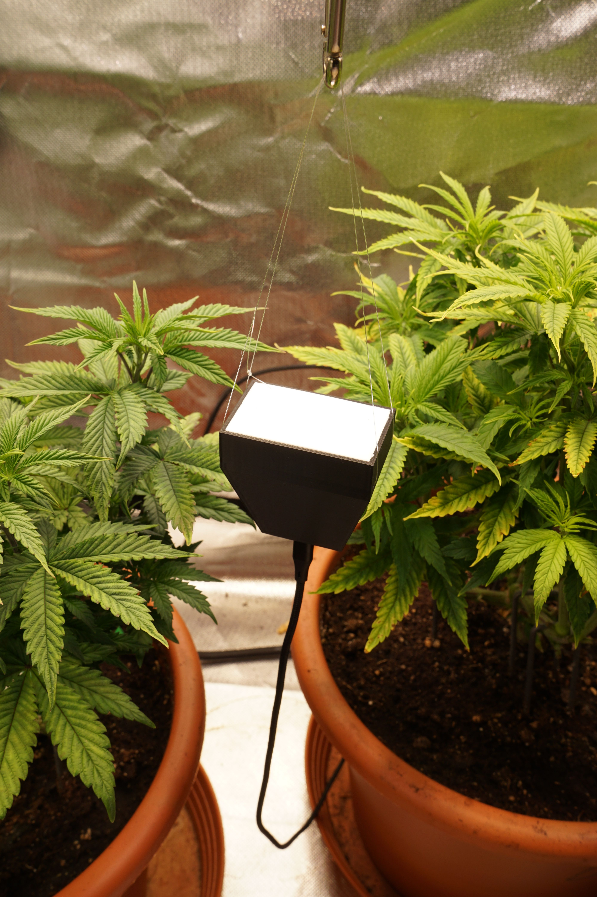

# esp32-wifi-spectrometer

- work in progress

Not a 3d wizard so the case is pretty meh but for now it does the job.
At the top there is a 2mm slot to push in some ptfe plate acting as a diffusor.

Mount: https://www.amazon.de/ULANZI-Ausziehbares-Lichtstativ-verstellbares-Schnellverschluss/dp/B0DGQ4781N

Added a second mount to just hang the spectrometer from the ceiling with the usb at the bottom.

